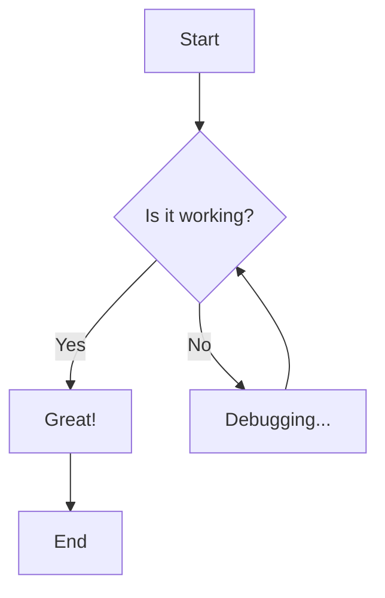

# VM Runtime

## Loading and Running a Program

[Chapter 5. Loading, Linking, and Initializing](https://docs.oracle.com/javase/specs/jvms/se24/html/jvms-5.html)

```mermaid
graph TD;
    A[Start] --> B{Is it working?};
    B -- Yes --> C[Great!];
    B -- No --> D[Debugging...];
    D --> B;
    C --> E[End];
```
